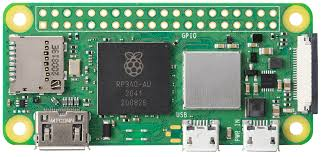

# Hydra Terminal - BLE Payment Terminal Documentation

## Table of Contents

1. [Overview](#overview)
2. [Architecture](#architecture)
3. [Hardware Requirements](#hardware-requirements)
4. [Software Dependencies](#software-dependencies)
5. [Installation & Setup](#installation--setup)
6. [BLE Protocol Implementation](#ble-protocol-implementation)
7. [API Integration](#api-integration)
8. [Payment Flow](#payment-flow)
9. [Usage Guide](#usage-guide)
10. [Troubleshooting](#troubleshooting)
11. [Development](#development)

## Overview

The Hydra Terminal is a Bluetooth Low Energy (BLE) payment terminal designed for the Hydrapay micropayments system. It operates as a contactless payment terminal that communicates with mobile devices via BLE to facilitate secure micropayments using Cardano blockchain technology.

### Key Features

- **BLE Beacon Functionality**: Acts as a discoverable BLE peripheral device
- **Real-time Communication**: Uses WebSocket for real-time communication with merchant applications
- **Cardano Integration**: Handles ADA and custom asset micropayments
- **Raspberry Pi Compatible**: Optimized for Raspberry Pi Zero 2W hardware
- **Secure Payment Processing**: Implements secure payment verification and processing

## Architecture

The system consists of several interconnected components:

```
┌─────────────────┐    ┌─────────────────┐    ┌─────────────────┐
│   Mobile App    │◄──►│  Hydra Terminal │◄──►│  Hydra API      │
│   (BLE Client)  │    │  (BLE Server)   │    │  (Backend)      │
└─────────────────┘    └─────────────────┘    └─────────────────┘
                              │
                              ▼
                       ┌─────────────────┐
                       │  Merchant App   │
                       │  (WebSocket)    │
                       └─────────────────┘
```

### Component Responsibilities

- **Mobile App**: Initiates payment by connecting to BLE terminal
- **Hydra Terminal**:
  - Advertises BLE services for payment discovery
  - Exchanges payment data via BLE characteristics
  - Communicates with backend API for payment processing
  - Notifies merchant application of payment status
- **Hydra API**: Handles fund queries and payment processing
- **Merchant App**: Manages payment requests and receives payment confirmations

## Hardware Requirements

### Primary Hardware



- **Raspberry Pi Zero 2W** (recommended)
  - ARM Cortex-A53 quad-core 64-bit processor
  - 512MB RAM
  - Built-in WiFi and Bluetooth 4.2
  - MicroSD card slot (minimum 8GB, Class 10)

### Hardware Setup

1. **SD Card Preparation**:

   - Flash Raspberry Pi OS Lite (64-bit recommended)
   - Enable SSH and WiFi during initial setup
   - Configure static IP if needed for network stability

2. **Bluetooth Configuration**:

   - Ensure Bluetooth is enabled in system settings
   - Configure Bluetooth to run without authentication for BLE advertising
   - Set up proper permissions for BLE operations

3. **Network Configuration**:

   - Stable WiFi connection for API communication
   - Ensure port 3000 is available for WebSocket server
   - Configure firewall if necessary

4. **Power Requirements**:
   - 5V/2.5A power supply (USB-C)
   - Consider UPS for critical deployments

### Optional Hardware

- **Display**: Small LCD for status monitoring
- **LED Indicators**: Visual feedback for payment status
- **Enclosure**: Weatherproof case for outdoor deployment

## Software Dependencies

### System Requirements

- **Operating System**: Linux (Raspberry Pi OS recommended)
- **Node.js**: Version 16.x or higher
- **npm**: Version 8.x or higher
- **Bluetooth Stack**: BlueZ 5.50 or higher

### Node.js Dependencies

```json
{
  "bleno": "@abandonware/bleno@^0.6.2",
  "express": "^5.1.0",
  "socket.io": "^4.8.1"
}
```

### Package Descriptions

- **bleno**: BLE peripheral library for Node.js (abandonware fork with continued support)
- **express**: Web framework for HTTP server
- **socket.io**: Real-time bidirectional event-based communication

## Installation & Setup

### 1. System Preparation

```bash
# Update system packages
sudo apt update && sudo apt upgrade -y

# Install Node.js (using NodeSource repository)
curl -fsSL https://deb.nodesource.com/setup_18.x | sudo -E bash -
sudo apt-get install -y nodejs

# Install Bluetooth development libraries
sudo apt-get install -y bluetooth bluez libbluetooth-dev

# Install build tools
sudo apt-get install -y build-essential
```

### 2. Bluetooth Configuration

```bash
# Enable Bluetooth service
sudo systemctl enable bluetooth
sudo systemctl start bluetooth

# Add user to bluetooth group
sudo usermod -a -G bluetooth $USER

# Configure Bluetooth to run without authentication
sudo nano /etc/bluetooth/main.conf
# Add or modify:
# [General]
# ControllerMode = dual
# DiscoverableTimeout = 0
# PairableTimeout = 0
```

### 3. Application Setup

```bash
# Clone or download the application
cd /opt
sudo git clone <repository-url> hydra-terminal
cd hydra-terminal

# Install dependencies
npm install

# Set proper permissions
sudo chown -R $USER:$USER /opt/hydra-terminal
chmod +x src/index.js
```

### 4. Service Configuration (Optional)

Create a systemd service for automatic startup:

```bash
sudo nano /etc/systemd/system/hydra-terminal.service
```

```ini
[Unit]
Description=Hydra Terminal BLE Payment Service
After=bluetooth.service
Wants=bluetooth.service

[Service]
Type=simple
User=pi
WorkingDirectory=/opt/hydra-terminal
ExecStart=/usr/bin/node src/index.js
Restart=always
RestartSec=10
Environment=NODE_ENV=production

[Install]
WantedBy=multi-user.target
```

Enable and start the service:

```bash
sudo systemctl enable hydra-terminal.service
sudo systemctl start hydra-terminal.service
```

## BLE Protocol Implementation

### Service UUID

```
Service UUID: 1d4ddcb2-279d-42e2-a95a-274352a25248
```

### Characteristics

#### 1. Merchant Address (Read-Only)

- **UUID**: `a781af9a-9a04-4422-9d78-9014497ccdc0`
- **Properties**: Read
- **Purpose**: Contains the merchant's Cardano address
- **Data Format**: UTF-8 string

#### 2. Payment Amount (Read-Only)

- **UUID**: `61b64163-35fa-438a-810c-018d1a719667`
- **Properties**: Read
- **Purpose**: Contains the payment amount in smallest unit
- **Data Format**: UTF-8 string (integer)

#### 3. Asset Unit (Read-Only)

- **UUID**: `52f34145-0363-4f4e-9fab-a133e8e5b0b1`
- **Properties**: Read
- **Purpose**: Specifies the asset being used for payment
- **Data Format**: UTF-8 string (e.g., "lovelace", "asset_policy_id")

#### 4. Client Address (Read/Write)

- **UUID**: `9b16159d-7c3e-4ae6-990b-0d34f22389bb`
- **Properties**: Read, Write
- **Purpose**: Receives client's Cardano address for payment processing
- **Data Format**: UTF-8 string

### BLE Advertising

- **Device Name**: "Hydra TERM"
- **Service UUIDs**: `1d4ddcb2-279d-42e2-a95a-274352a25248`
- **Connectable**: Yes
- **Discoverable**: Yes

## API Integration

### Backend API Configuration

The terminal communicates with a Hydra API backend for payment processing:

```javascript
const API_BASE_URL = "http://<your.service.ip.address>:5000";
```

Make sure you use an https server for hosting the back-end sydra service in production.

### API Endpoints

#### 1. Query Funds

- **Endpoint**: `GET /query-funds?address={clientAddress}`
- **Purpose**: Retrieves available funds for a client address
- **Response**: Object containing `fundsInL2` array with UTXO references

#### 2. Pay Merchant

- **Endpoint**: `POST /pay-merchant`
- **Purpose**: Processes payment from client to merchant
- **Request Body**:

```json
{
  "merchant_address": "string",
  "funds_utxo_ref": {
    "hash": "string",
    "index": "number"
  },
  "amount": [
    ["asset_unit", amount_in_smallest_unit],
    ["lovelace", 3000000]
  ],
  "signature": "string"
}
```

### WebSocket Server

- **Port**: 3000
- **CORS**: Configured for `http://localhost:3000`
- **Events**:
  - `requestFunds`: Initiates payment process
  - `payed`: Notifies merchant of successful payment
  - `disconnect`: Handles client disconnection

## Payment Flow

### 1. Payment Initiation

1. Merchant application sends `requestFunds` event via WebSocket
2. Terminal receives payment data (amount, merchant address, asset unit)
3. BLE service starts advertising with payment information
4. Characteristics are configured with payment details

### 2. Client Connection

1. Mobile app discovers "Hydra TERM" BLE device
2. Client connects to BLE service
3. Client reads payment details from characteristics:
   - Merchant address (Char1)
   - Payment amount (Char2)
   - Asset unit (Char4)

### 3. Payment Processing

1. Client writes their address to Char3 (write characteristic)
2. Terminal queries client funds via API
3. Terminal processes payment via API
4. Terminal notifies merchant of payment status

### 4. Payment Completion

1. Merchant receives `payed` event with payment details
2. BLE advertising stops
3. Service resets for next payment

## Usage Guide

### Starting the Terminal

```bash
# Development mode with auto-restart
npm run dev

# Production mode
node src/index.js
```

### Merchant Integration

```javascript
// Connect to terminal WebSocket
const socket = io("http://terminal-ip:3000");

// Request payment
socket.emit("requestFunds", {
  address: "merchant_cardano_address",
  amount: 10.5, // Payment amount
  decimals: 6, // Asset decimals
  assetUnit: "lovelace", // Asset identifier
});

// Listen for payment confirmation
socket.on("payed", (paymentData) => {
  console.log("Payment received:", paymentData);
});
```

### Monitoring

- Check terminal logs for BLE and payment activity
- Monitor WebSocket connections
- Verify API connectivity
- Check Bluetooth status: `sudo systemctl status bluetooth`

## Troubleshooting

### Common Issues

#### 1. BLE Advertising Not Working

```bash
# Check Bluetooth status
sudo systemctl status bluetooth

# Restart Bluetooth service
sudo systemctl restart bluetooth

# Check BLE permissions
sudo setcap cap_net_raw+eip $(eval readlink -f `which node`)
```

#### 2. Permission Denied Errors

```bash
# Add user to bluetooth group
sudo usermod -a -G bluetooth $USER
# Logout and login again

# Set proper capabilities for Node.js
sudo setcap cap_net_raw+eip $(eval readlink -f `which node`)
```

#### 3. API Connection Issues

- Verify API server is running and accessible
- Check network connectivity
- Verify API_BASE_URL configuration
- Check firewall settings

#### 4. WebSocket Connection Problems

- Ensure port 3000 is available
- Check CORS configuration
- Verify client connection URL

### Debug Commands

```bash
# Check BLE devices
sudo hcitool lescan

# Monitor Bluetooth logs
sudo journalctl -u bluetooth -f

# Check Node.js process
ps aux | grep node

# Monitor network connections
netstat -tulpn | grep :3000
```

### Log Analysis

The application provides detailed logging for:

- BLE state changes
- Payment processing steps
- API communication
- WebSocket events
- Error conditions

## Development

### Project Structure

```
hydra-terminal/
├── src/
│   ├── index.js          # Main application entry point
│   ├── socket.js         # WebSocket server configuration
│   ├── services.js       # API integration functions
│   └── characteristics.js # BLE characteristics implementation
├── assets/               # Documentation images
├── package.json         # Dependencies and scripts
└── README.md           # Basic project information
```

### Development Setup

1. Clone the repository
2. Install dependencies: `npm install`
3. Configure API endpoint in `services.js`
4. Run in development mode: `npm run dev`

### Code Architecture

- **Modular Design**: Each component has a specific responsibility
- **Event-Driven**: Uses WebSocket and BLE events for communication
- **Error Handling**: Comprehensive error handling throughout
- **Async Operations**: Proper handling of asynchronous API calls

### Testing

- Test BLE functionality with mobile BLE scanner apps
- Verify API integration with test endpoints
- Test WebSocket communication with merchant applications
- Validate payment flows end-to-end

### Security Considerations

- BLE communication is not encrypted (consider additional security layers)
- API communication should use HTTPS in production
- Implement proper authentication for merchant applications
- Consider rate limiting for payment requests

---

## Support

For technical support or questions regarding the Hydra Terminal:

- Check the troubleshooting section above
- Review application logs for error details
- Ensure all dependencies are properly installed
- Verify hardware and network configuration

---

_This documentation covers the complete setup and operation of the Hydra Terminal BLE payment system. For updates and additional information, refer to the project repository._
