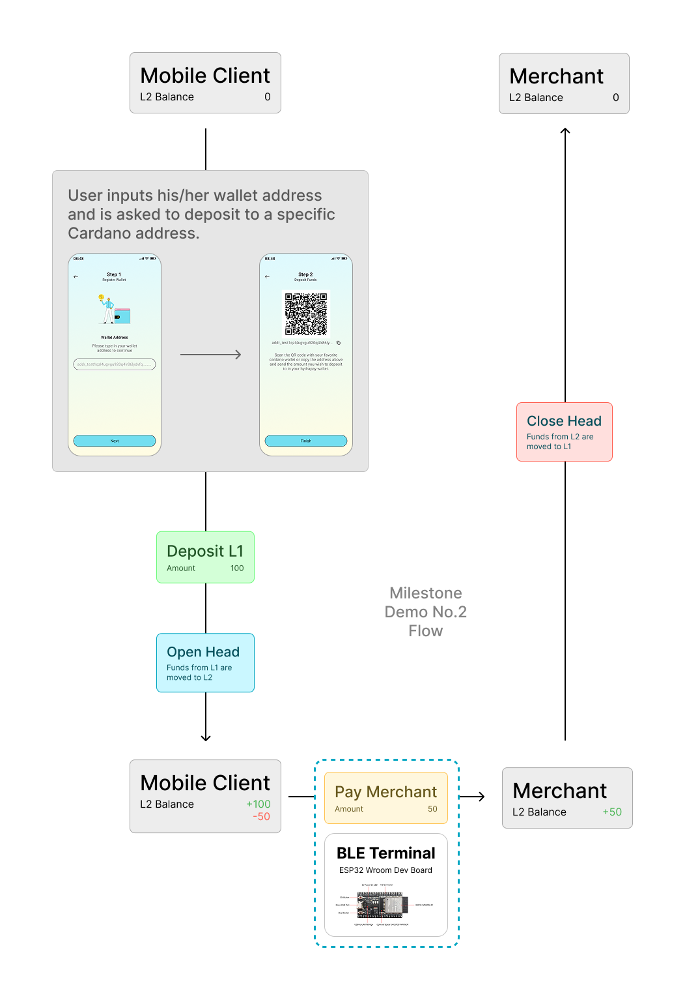

# hydra-terminal

This repository is part of the Hydrapay micropayments system. More specifically, this is the code which runs on the BLE terminal or contactless payment terminal.

## Requirements

- Node JS + npm [home](https://nodemon.io/)
- nodemon [docs](https://nodemon.io/)
- bleno [docs](https://github.com/noble/bleno)
- socket.io [home](https://socket.io/)

## Hardware

Our terminal uses a Raspberry pi Zero 2W micro computer running a custom linux OS. The device is programed using nodejs in order to behave as a BLE Beacon.

## Diagram

Please find the BLE beacon in the flow diagram, as the contactless payment terminal.

